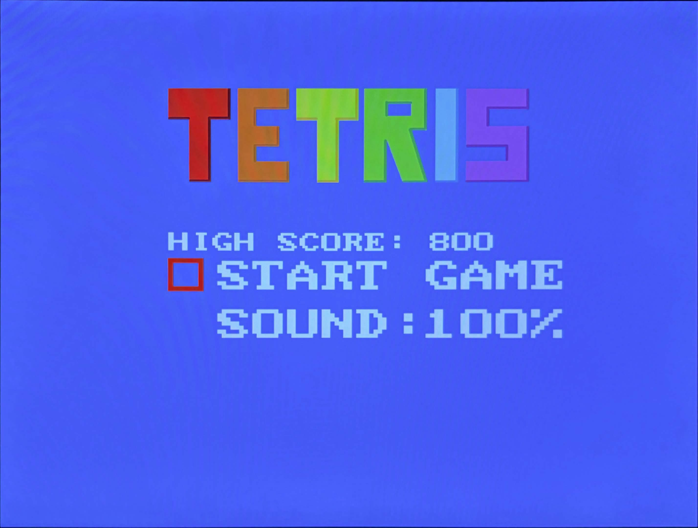
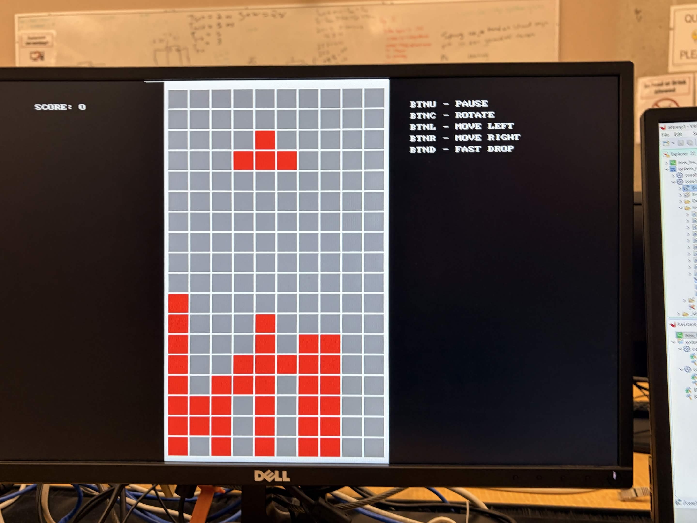
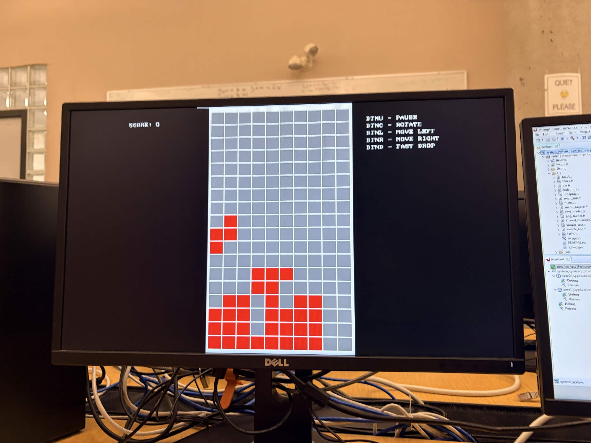

# Tetris on Zedboard Zynq-7000
This is a Tetris game built to run on the [Zedboard Zynq-7000](https://digilent.com/shop/zedboard-zynq-7000-arm-fpga-soc-development-board/?srsltid=AfmBOoowJEGiRcV7L6c5d6dKkC5mMLZLUGxVGknO0NxrmFk0kgSoPUmH) which includes:
- custom hardware system that runs on the programmable fabric
- two software systems built for the [Zync-7000](https://www.amd.com/en/products/adaptive-socs-and-fpgas/soc/zynq-7000.html)'s dual core architecture. 

---

## Project Overview

#### Custom Hardware
- Built using HDL (VHDL and Verilog) and runs on the PL of Zynq-7000
- VGA controller for video output
- Audio controller for audio output
- GPU for graphics rendering of the game screen
- LFSR for random number generation

#### Software System
- Written in low level C++ and runs on the PS of Zynq-7000
- Interrupt based system for button controls and game ticks
- Video Driver connecteing software system with the hardware GPU
- Custom designed Tetris game logic
- Interface logic for menus and user interactions
- Software based rendering pipeline for menus and UI interfaces
- Audio driver for game audio
- Inter-core communications

#### Project Structure

```
📁 hardware/                # necessary script and IP for the system in Vivado
 ├─ 📄 build.tcl            # automatic build script
 ├─ 📄 block_design.tcl     # script for generating custom hardware layout
 ├─ 📄 design_wrapper.xsa   # bitstream for the hardware platform
 ├─ 📁 constraints/         # constraint files for ZedBoard
 ├─ 📁 ip/                  # custom IPs used for this project
 │   ├─ 📁 gpu/
 │   ├─ 📁 lfsr/
 │   ├─ 📁 vga controller/
 │   ├─ 📁 audio controller/
📁 images/                  # screenshots and photos of this game
📁 software/                # workspace directory for Vitis
 │   ├─ 📁 core0/           # software system for the game
 │   ├─ 📁 core1/           # audio system for the game
 │   ├─ 📁 tetris_plt/      # hardware platform
```

---

## Prerequisites

This project is developed on Windows 11 and runs on ZedBoard Zync-7000

- Vivado 2020.2
- Xilinx Vitis 2020.2
- ZedBoard Zync-7000

---

## Vivado Setup

1. Open Vivado
2. Click "Create Project" (in Quick Start section), a "New Project" window should pop up
3. Click "Next"
4. Optional: enter a project name
5. For "Project Location", navigate to this folder
6. For "Project Type", select "RTL Project", then click "Next"
7. No need to add sources yet, click "Next"
8. No need to add constraint files yet, click "Next"
9. For "Default Part", switch from "Parts" to "Boards", and then search for "ZedBoard", there should only be one result, select and click "Next"
10. Verify that informations are correct, Default Board: "ZedBoard Zynq Evaluation and Development Kit", Product: "Zynq-7000", Family: "Zynq-7000"
11. Click "Finish", this should initialize a new project environment


After the intial setup, the whole window should change. At the bottom, there should be a window with multiple tabs including "Tcl Console", "Messages", "Log", "Reports", and "Design Runs". Switch to "Tcl Console" and run the following command to rebuild the project hardware.

### Automatic Rebuild

You can try running the included build script
```tcl
source [file dirname [get_property DIRECTORY [current_project]]]/hardware/build.tcl
```

If the above command fails, then try again, if issues persist, try doing it manually following the instructions below

### Manual Rebuild

Add the custom ip repo
```tcl
set_property  ip_repo_paths  [file dirname [get_property DIRECTORY [current_project]]]/hardware/ip [current_project]
update_ip_catalog
```

Add the constraint files
```tcl
add_files -fileset constrs_1  [file dirname [get_property DIRECTORY [current_project]]]/hardware/constraints/adventures_with_ip.xdc
add_files -fileset constrs_1  [file dirname [get_property DIRECTORY [current_project]]]/hardware/constraints/zedboard_master.xdc
```

Rebuild the project hardware
```tcl
source [file dirname [get_property DIRECTORY [current_project]]]/hardware/tetris.tcl
```

Generate block design
```tcl
generate_target all [get_files  [get_property DIRECTORY [current_project]]/[current_project]/[current_project].srcs/sources_1/bd/design_1/design_1.bd]
```

Add wrapper
```tcl
make_wrapper -files [get_files [get_property DIRECTORY [current_project]]/[current_project].srcs/sources_1/bd/design_1/design_1.bd] -top
```

### Generating Bitstream

After the block designs are rebuilt, click "Generate Bitstream" in the "Program and Debug" section on the left. After the bitstream is successfully generated, export the bitstream

```tcl
write_hw_platform -fixed -include_bit -force -file [file dirname [get_property DIRECTORY [current_project]]]/software/design_wrapper.xsa
```

This bitstream can be used for this project, however an existing one is provided in the "hardware" folder

---

## Vitis Setup

1. Open Vitis
2. For "workspace", navigate to the "software" folder
3. Click "Launch"
4. Ignore any errors, the project should still build with no issues
5. Once the project is loaded, head to the top, under the "Project" tab, click "Build All"

---

## Running the Game

1. Once the build is complete, you can run it on your ZedBoard
2. Make sure your ZedBoard is connected to the computer via USB
3. Connect the ZedBoard to a monitor via VGA port, you need this for graphical output
4. In Vitis, in the "Explorer" tab on the left, right click on "dual_core_system"
5. In the options menu, go down to "Run As" > "Launch Hardware"
6. Wait for the device to be programed, the game should finish loading once the main menu appears on screen

---

## Screenshots and Photos





---

## Authors

- Andrew Ye ([@andrewy12345](https://github.com/andrewy12345))
- Matt Yu ([@MattYu2004](https://github.com/MattYu2004))